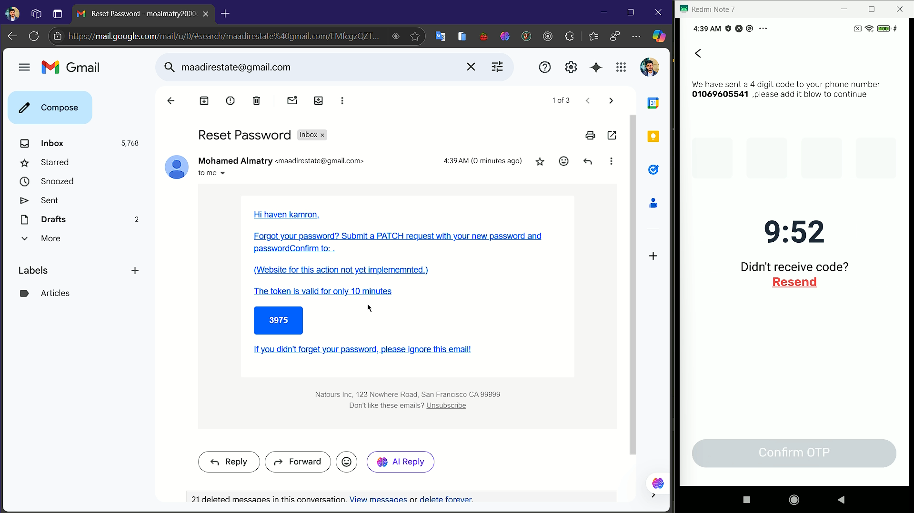

# Project Name Restaurant Demo

## Overview

This project consists of a client (React Native) and a server (Express). The client is built using Expo and React Native, while the server is built using TypeScript.

## Project Structure

## Client

##### Tested on Redmi Note 7 (3GB) , Redmi Note 13 Pro (8GB) & Samsung A50 (4GB)

##### Videos: https://drive.google.com/file/d/1i6Ti5LHnycCNobI2j0sRhkebo7LFrAIo/view?usp=sharing

##### Videos: https://drive.google.com/file/d/1j_YFdGkCCLE5J-jEEYd0In8nTYsu4_CL/view?usp=sharing

Technical Stack

- Native Wind
- Zod
- Redux (Redux toolkit)
- React Hook Form
- Expo Router
- AsyncStorage
- Expo SecureStore

Features

- Typescript code
- Authentication OTP Logic Applied for login & signup (Real Auth with backend)
- Logout functionality
- Detect Device Languages if no language set
- Order Management (Fake)
- Order Details (Fake)
- Multi-Language Support
- Animation Support in every inch (reanimated)
- Advanced State Management (Redux & RTK Query )
- Components Support Cn For Usability
- File Base Router
- Beautiful Toast Alerts
- Smooth Loading Indicator

The client is an Expo project with the following structure:

- `app/`: Contains the main application code.
- `assets/`: Contains images, fonts, and other static assets.
- `components/`: Reusable UI components.
- `constants/`: Application constants.
- `hooks/`: Custom React hooks.
- `lib/`: Utility functions and libraries.
- `navigation/`: Navigation configuration.
- `providers/`: Context providers.
- `screens/`: Application screens.
- `services/`: API services.
- `store/`: Redux store configuration.
- `util/`: Utility functions.
- `validators/`: Validation functions.

### Key Files

- [app.json](client/app.json): Expo configuration file.
- [babel.config.js](client/babel.config.js): Babel configuration file.
- [metro.config.js](client/metro.config.js): Metro bundler configuration file.
- [tsconfig.json](client/tsconfig.json): TypeScript configuration file.
- [constants/images.ts](client/constants/images.ts): Image constants.
- [constants/icons.ts](client/constants/icons.ts): Icon constants.
- [app/\_layout.tsx](client/app/_layout.tsx): Main layout component.

### Fonts

The project uses the Rubik font family, which is loaded in the [app/\_layout.tsx](client/app/_layout.tsx) file.

### Localization

Localization is handled using `expo-localization` and `react-native-i18n`. The locale is set based on the device language or stored language preference.

## Server

Technical Stack

- Express
- Zod
- mongoose
- argon2
- mongo sanitize
- express rate limit
- helmet
- jwt token
- nodemailer
- sharp

Features

- OTP Login Support
- more than 10 endpoints

The server is a TypeScript project with the following structure:

- `config/`: Configuration files.
- `src/`: Source code.
- `src/middleware`: All Global middlewares
- `src/controller`: Controllers
- `src/module`: Database Schema
- `src/routes`: api endpoints
- `src/services`: database calls
- `src/templates`: mail templates
- `src/services`: zod validators
-

### Key Files

- [tsconfig.json](server/tsconfig.json): TypeScript configuration file.

## Quickstart

### Client

1. Install dependencies:

   ```sh
   cd client
   pnpm install
   ```

2. Start Project :
   ```sh
   pnpm start
   ```

### Server

1. Install dependencies:

   ```sh
   cd Server
   pnpm install
   ```

2. Start Project :

   ```sh
   pnpm start:dev
   ```

3. .env example

```sh
BASE_URL=http://localhost:7000
ORIGIN_URL=https://example.com
JWT_SECRET=Example
JWT_EXPIRES=90d
EMAIL_FROM =hello@mo-almatry.com
```
